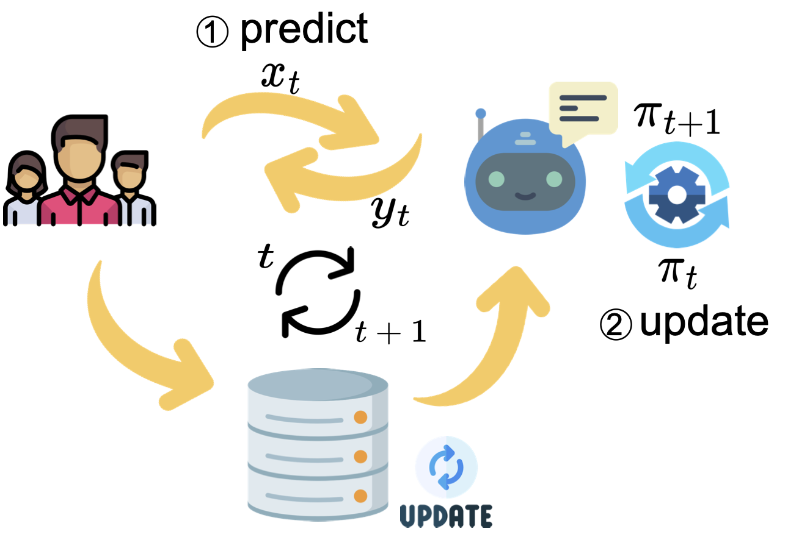

## Real-time Test-time Adaptation for Robust Question Answering under Distribution Shifts

This repository is the code for our paper [Real-time Test-time Adaptation for Robust Question Answering under Distribution Shifts]() at Findings of EMNLP2022, which includes our proposed COLDQA benchmark and the implementation of the methods for test-time adaptation (PL, Tent and OIL). 


## Quick Links
  - [Overview](#overview)
  - [COLDQA Benchmark](#coldqa-benchmark)
    - [Source Distribution](#source-distribution)
    - [Target Distribution](#target-distribution)
  - [TTA Method: Quick Start](#tta-method-quick-start)
    - [Requirements](#requirements)
    - [Download the data](#download-the-data)
    - [Obtain Base Model](#obtain-base-model)
    - [Run TTA Method](#run-tta-method)
  - [Main Results](#main-results)


## Overview

A deployed question answering (QA) model can easily fail when the test data has a distribution shift compared to the training data. 
Robustness tuning (RT) methods have been widely studied to enhance model robustness against distribution shifts before model deployment. 
However, can we improve a model after deployment? 
To answer this question, we evaluate test-time adaptation (TTA) to improve a model after deployment, and compare it with RT methods. 

Specifically, 
* We first introduce a new benchmark named COLDQA for robust QA, which unifies the evaluation on cross-lingual transfer, domain adaptation and corruption robustness,
* based on which, we present OIL for real-time TTA, a novel TTA method that is inspired by imitation learning and further enhanced by casual inference. 



## COLDQA Benchmark

We introduce COLDQA to study robust QA under distribution shifts, which is a unified evaluation benchmark against text **Co**rruptions, cross **l**anguages and **d**omain shifts.

To do the evaluation on COLDQA, a model should be firstly trained on the source distribution, then test the trained model on each subset from each target dataset.


### Source Distribution

The training data for the source distribution is from SQuAD v1.1.

| Source | \|Train\| | \|Dev\| |
| :----- | :-------: | :-----: |
| SQuAD  | 87,599    | 34,726  |


### Target Distribution

| Target Dataset | Distribution Shift | \|Subset\| |   \|Test\|   | Metric  |
| :------------- | :----------------: | :--------: | :----------: | :-----: |
| NoiseQA-syn    |  Text Corruptions  |     3      |    1,190     | EM / F1 |
| NoiseQA-na     |  Text Corruptions  |     3      |    1,190     | EM / F1 |
| XQuAD          |  Cross Languages   |     11     |    1,190     | EM / F1 |
| MLQA           |  Cross Languages   |     7      | 4,517–11,590 | EM / F1 |
| HotpotQA       |   Domain Shifts    |     1      |    5,901     | EM / F1 |
| NaturalQA      |   Domain Shifts    |     1      |    12,836    | EM / F1 |
| NewsQA         |   Domain Shifts    |     1      |    4,212     | EM / F1 |
| SearchQA       |   Domain Shifts    |     1      |    16,980    | EM / F1 |
| TriviaQA       |   Domain Shifts    |     1      |    7,785     | EM / F1 |


## TTA Method: Quick Start

TTA adapts a source model with test-time data from a target distribution.

We will show how to run TTA method with our code repository in this part.

### Requirements

You should run the following script to install the dependencies first.

```bash
pip install --user .
pip install torch==1.7.1+cu110 torchvision==0.8.2+cu110 torchaudio===0.7.2 -f https://download.pytorch.org/whl/torch_stable.html
```
(To be notated, the results in our paper were obtained by training on the GPU of NVIDIA A100.)

### Download the data

To this end, follow these steps:

1. create a `download` folder with `mkdir -p download` in the root of this project,
2. download the datasets from [here](https://huggingface.co/datasets/oceanpty/ColdQA), unzip them, and put the unzipped files under the `download` folder.


### Obtain the Base Model

To evaluate the model generalization on COLDQA, we firstly need to train a source model with the source training data. 

In the paper, we adapt the xlm-roberta-base/large, xlm-roberta-base/large with xTune as our base model.
You can train the former two from [here](https://github.com/google-research/xtreme) and the latter two from [here](https://github.com/bozheng-hit/xTune).

For better reproduction, we directly provide the model trained on the source dataset for download:
* [xlm-roberta-base](https://huggingface.co/oceanpty/xlmr-base-squad),
* [xlm-roberta-large](https://huggingface.co/oceanpty/xlmr-large-squad),
* [xlm-roberta-base (xTune)](https://huggingface.co/dyyyyyyyy/xTune_squad_XLM-RoBERTa-base),
* [xlm-roberta-large (xTune)](https://huggingface.co/dyyyyyyyy/xTune_squad_XLM-RoBERTa-large).


### Run TTA Methods

You may run by the following command:

```bash
bash scripts/run_[TASK].sh [MODEL] [DATA] [GPU] [MODEL_PATH] [SEED] [METHOD]
```
The predictions will be saved to the `MODEL_PATH` directory.

Arguments for the evaluation script are as follows: 

* `TASK`: Distribution shift type. Choose in `noiseqa`, `xquad`, `mlqa` or `mrqa`,
* `MODEL`: Base model type. Choose in `xlm-roberta-base` or `xlm-roberta-large`,
* `DATA`: Data type. Choose in `noiseQA-syn`, `noiseQA-na`, `xquad`, `mlqa` or `mrqa` (should match the corresponding `TASK`),
* `GPU`: GPU ID,
* `MODEL_PATH`: The path of a trained base model checkpoint directory,
* `SEED`: Random seed,
* `METHOD`: TTA method. Choose in `Tent`, `PL` or `OIL`.

Detailed hyper-parameters can be seen in the corresponding scripts.


## Main Results on COLDQA

For xlmr-base: 

| Method    | EM (Avg) | F1 (Avg) |
| :-------- | :------: | :------: |
| xlmr-base |  55.11   |  69.21   |
| xTune     |  58.54   |  71.94   |
| Tent      |  56.24   |  69.68   |
| PL        |  56.45   |  69.78   |
| OIL       |  57.06   |  70.38   |
| xTune+PL  |  58.86   |  71.89   |
| xTune+OIL |  59.63   |  72.68   |


For xlmr-large: 

| Method     | EM (Avg) | F1 (Avg) |
| :--------- | :------: | :------: |
| xlmr-large |  58.58   |  73.82   |
| xTune      |  61.51   |  76.06   |
| Tent       |  54.56   |  70.34   |
| PL         |  61.80   |  76.05   |
| OIL        |  62.04   |  76.19   |
| xTune+PL   |  63.73   |  77.01   |
| xTune+OIL  |  64.57   |  77.93   |
